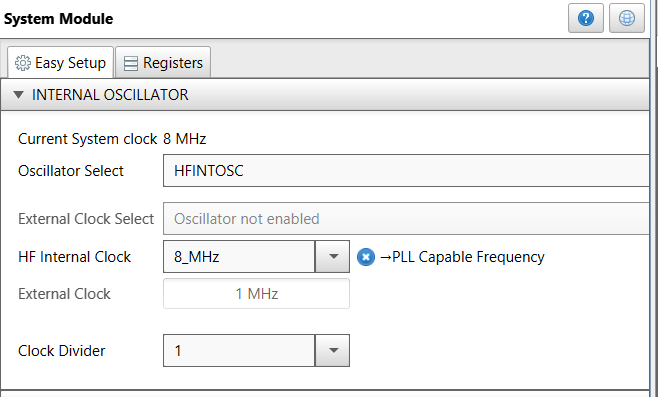
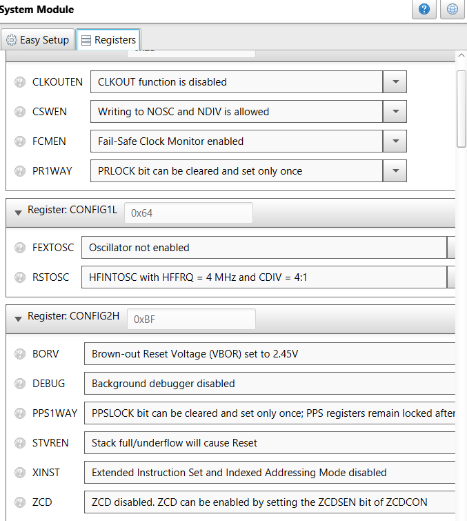
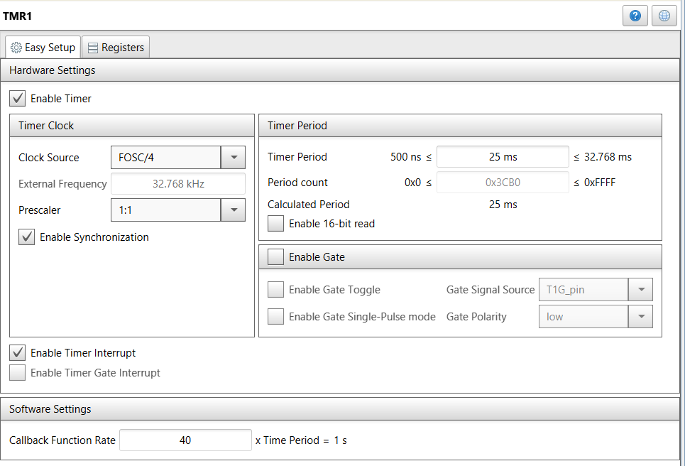
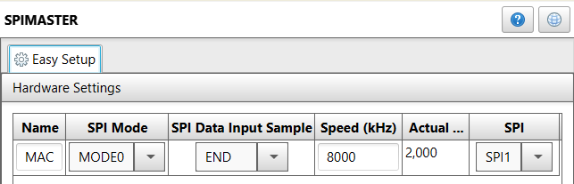
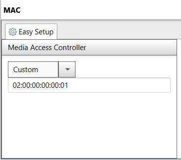
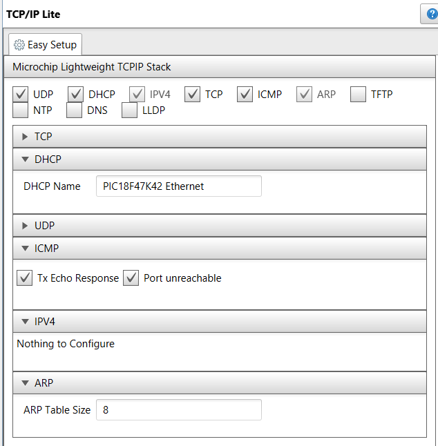
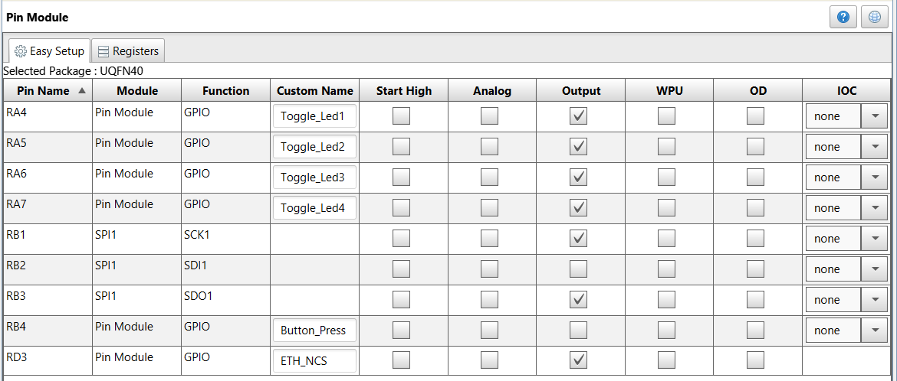
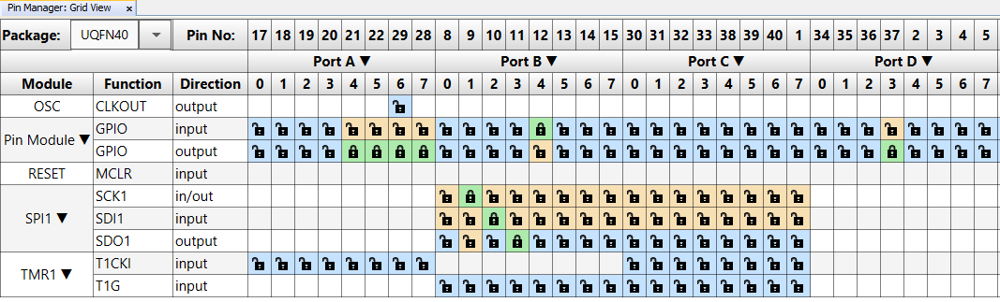

  <article class="markdown-body entry-content p-3 p-md-6" itemprop="text">

# LAN9250

The repository provides the driver for enabling the TCP and UDP communication in LAN9250 ethernet controller. The user can build upon this application to extend the capabilities of the LAN9250 controller.

## Required Tools:

Hardware tools:

* LAN9250 Click Board
* PIC18F47K42 (40-pin, PDIP) MCU
* The Curiosity development board
* Ethernet cables (RJ45)
* Ethernet switch with power supply

Software tools:

* MPLAB® X IDE 5.25 or later
* MPLAB® Code Configurator (Plugin)
* XC8® Compiler 2.05 or later
* Microchip TCP/IP Lite Stack (AN1921)
* Wireshark Packet Analyzer

## MCC Settings
Here are the settings used for MSSP, MAC, TMR, Pin module, TCP/IP Lite and System module.

### System Module Settings

### System Conguration Register Settings

### TMR Settings

### MSSP Settings

### MAC Settings

### TCP/IP Settings

### Pin Module Settings

### Pin Manager Settings

