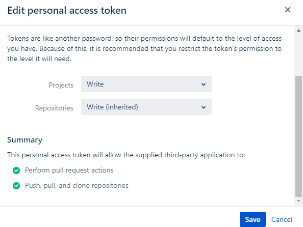

# GitHub Deployment Tool with Markdown Based Release Description

Using Github Deployment Tool, user can automatically create Github repository, update Github repository, deploy bitbucket source to GitHub repository, and process a GitHub release object with Markdown release notes.

This is a GitHub deployment tool with the following features,
1. Deploy any Bitbucket branch to GitHub
2. Create a GitHub repository if required.
3. GitHub release asset creation.
4. Edit a GitHub topics.
5. Edit a GitHub repository Description.
6. Attach any file/binary as release artifact.
7. Create a markdown based release description.
8. Edit a release description
9. Delete a release description

## Index
- Setting up the Prerequisites 
- Description for GitHub Deployment Tool
- Demonstrate how to run Github Deployment Tool on the local machine

## Procedure: Setup
Please follow the below steps to install the pre-requisite tools.
* [](https://www.python.org/downloads/)
* [](https://github.com/PyGithub/PyGithub)
* [](https://atlassian-python-api.readthedocs.io/)

### Steps to install prerequisite tools 
1. Create a folder with some convenient name for the project in your local machine, inside this created folder clone the [prerequisite](https://bitbucket.microchip.com/scm/citd/tool-environment-setup.git) repository , cloning can be done by running the following command in command prompt inside the created folder. How to clone git repository [click here](https://www.toolsqa.com/git/git-clone/)

```
git clone https://bitbucket.microchip.com/scm/citd/tool-environment-setup.git
```

2. Root folder of the cloned repository will have a batch script called `prerequisites.bat` and a shell script called `prerequisites.sh`.

    Please run batch script for windows OS as an <b>Administrator</b> or run shell script on linux OS ,please provide file execute permission for the shell script by using the following command <b>chmod 755</b>.

        - Windows OS
            - Start > Type 'cmd' > Right Click on command prompt > Run as administrator. Then enter the full path of the batch file, enter.

        - Linux OS
            - chmod <permissions> <filename>

3.  Validation of all the installed pre-requisite tools can be done by following the below steps.
        - Run the following commands in the command line after the installation of the prerequisite tools. (Note: Commands can be executed from any directory)
        
        1. `python --version` This command is to validate the NodeJS installation in the machine.
            
            Command prompt output example
            ```
            Python 3.7.3
            ```
            `Note: Python 3.7.3 or above`
        
        `Note : For all the prerequisite tools installed , the corresponding installed tool version should be displayed on the command prompt on running the above mentioned commands`

4. If the auto installation fails by following the above steps, Pre-requisite tools can also installed manually one by one. Prerequisite tools that needs to be installed are as follows 
    
    - [](https://www.python.org/downloads/) or above
        - Windows: '<PYTHON_HOME>', '<PYTHON_HOME>/Scripts' and '<PYTHON_HOME>/libs'
        - Linux: '<PYTHON_HOME>', '<PYTHON_HOME>/Scripts' and '<PYTHON_HOME>/libs' 
        - where PYTHON_HOME : PYTHON_HOME root folder path.

    Download and install the above mentioned tool(s) and set the tool paths in system environment variable.
    - To know how to install application and add environment variable
        - Install windows application [click here](https://www.computerhope.com/issues/ch000561.htm)
        - Install linux application [click here](https://www.guru99.com/how-to-install-java-on-ubuntu.html)
        - Add environment variable for windows [click here](https://www.computerhope.com/issues/ch000549.htm)
        - Add environment variable for linux [click here](https://www.geeksforgeeks.org/environment-variables-in-linux-unix/).

### Steps to install prerequisite python library
1. Run the following command in the Command prompt or terminal to install `PyGithub` library

    ```
    $ pip install PyGithub
    ```

    Validation of all the installed pre-requisite python library can be done by following the below steps.

        - Run the following command in the Command prompt or terminal.
            - $ python
            - $ import github

        - If you get "ModuleNotFoundError: No module named 'github'" error, Please make sure 'PyGithub' library installation success. Otherwise, setup is successful.

2. Run the following command in the Command prompt or terminal to install `atlassian-python-api` library

    ```
    $ pip install atlassian-python-api
    ```

    Validation of all the installed pre-requisite python library can be done by following the below steps.

        - Run the following command in the Command prompt or terminal.
            - $ python
            - $ from atlassian import Confluence

        - If you get "ModuleNotFoundError: No module named 'atlassian'" error, Please make sure 'atlassian-python-api' library installation success. Otherwise, setup is successful.

## Description for GitHub Deployment Tool
The tool is capable of automatically create Github repository, update Github repository, deploy bitbucket source to GitHub repository, and process a GitHub release object with Markdown release notes.

**Note:**  repository should have the readme.md, changelog.md and license files under root directory

    - GitHub Repository Operation
        - Create a new repository
            - Repository name
            - Repository Description
            - Repository has issue option
            - Repository has project option
            - Repository manage access (Private or Public)
            - Repository topics
            - Repository default branch (Default master branch)

        - Update a existing repository
            - Repository name
            - Repository Description
            - Repository has issue option
            - Repository has project option
            - Repository manage access (Private or Public)
            - Repository topics
            - Repository default branch (Default master branch)

    - Deploy Source Operation (Bitbucket repository to GitHub repository)
        - Deploying source with selective branch and tags
    
    - Deploy release object
        - Create a release
        - Edit a release
        - Delete a release
        - Upload artifact asset Files 

### Input Arguments:
Script Input Arguments: 
```
usage: tool-github-deploy.py [-h]
                                [-gpat GITHUB_PERSONAL_ACCESS_TOKEN]
                                [-rpn REPO_NAME] 
                                [-dm DEBUG_MODE]

                                [-rpo REPO_OPERATION] 
                                    [-rpd REPO_DESC]
                                    [-rpt REPO_TOPICS] 
                                    [-rphi REPO_HAS_ISSUES]
                                    [-rphp REPO_HAS_PROJECTS]
                                    [-rpp REPO_PRIVATE]
                                    [-rpdb REPO_DEFAULT_BRANCH] 
                                    [-rpu REPO_UPDATE]
                                    [-rporg REPO_ORGANIZATION]

                                [-rlo RELEASE_OPERATION]
                                    [-rlnp RELEASE_NOTE_PATH] 
                                    [-rltv TAG_VERSION]
                                    [-rltt TAG_TITLE] 
                                    [-rlua UPLOAD_ASSETS]
                                    [-rle EDIT_RELEASE] 
                                    [-rld DELETE_RELEASE]

                                [-deploy DEPLOYMENT]
                                    [-dburl DEPLOY_BITBUCKET_URL]
                                    [-dgurl DEPLOY_GITHUB_URL]
                                    [-dgid DEPLOY_GITHUB_USER_ID]
                                    [-dbranch DEPLOY_BITBUCKET_BRANCH]
                                    [-dtag DEPLOY_BITBUCKET_TAG]
                                    [-def DEPLOY_EXCLUDES_FILES]
                                    [-dec DEPLOY_EXCLUDES_FILES_COMMIT]
                                
                                [-bto BITBUCKET_TAG_OPERATION]
                                    [-bid BITBUCKET_USER_ID]
                                    [-bpat BITBUCKET_PERSONAL_ACCESS_TOKEN]
                                    [-bpn BITBUCKET_PROJECT_NAME]
                                    [-btv BITBUCKET_TAG_NAME]
                                    [-bch BITBUCKET_COMMIT_HASH]
                                    [-btd BITBUCKET_TAG_DESCRIPTION]

tool-GitHub-deploy arguments:

where options include:
  -h, --help            show this help message and exit

    common arguments:
        -gpat, --github_personal_access_token   (Common: argument type String, This argument is used to provide the GitHub personal access token)
        -rpn, --repo_name                       (Common: argument type String, This argument is used to provide the GitHub repository name)
        -dm, --debug_mode                       (Common:argument type Boolean, This argument is used to set the Debug mode (default state is False))

    repository operation arguments:
        -rpo, --repo_operation        (repo: argument type Boolean, This argument is used to set the repository operation (default state is False))
        -rpd, --repo_desc             (repo: argument type String, This argument is used to provide the GitHub repository description)
        -rpt, --repo_topics           (repo: argument type String, This argument is used to provide the GitHub repository topics (comma separate, e.g. -rpt=["PIC24",  "dsPIC33"]))
        -rphi, --repo_has_issues      (repo: argument type Boolean, This argument is used to enable or disable the GitHub repositories "issues" option)
        -rphp, --repo_has_projects    (repo: argument type Boolean, This argument is used to enable or disable the GitHub repositories "Projects" option)
        -rpp, --repo_private          (repo: argument type Boolean, This argument is used to make the repository Private or Public)
        -rpdb, --repo_default_branch  (repo: argument type String, This argument is used to set the GitHub repository default branch)
        -rpu, --repo_update           (repo: argument type Boolean, This argument is used to set the GitHub repository updation (default state is False))
        -rporg, --repo_organization   (repo: argument type String, This argument is used to select the organization where the repo needs to be created. Users can provide the entire URL or just the organization name as the value of this argument.)

    release operation arguments:
        -rlo, --release_operation         (release: argument type Boolean, This argument is used to set the release operation (default state is False))
        -rlnp, --release_note_path        (release: argument type String, This argument is used to provide the local release note file path)
        -rltv, --tag_version              (release: argument type String, This argument is used to provide the release tag version)
        -rltt, --tag_title                (release: argument type String, This argument is used to provide the release tag title)
        -rlua, --upload_assets            (release: argument type String, This argument is used to provide the upload artifact assets files (comma separate, e.g. -rlua=archive.zip, support.doc))
        -rle, --edit_release              (release: argument type Boolean, This argument is used to edit a release in Github Repository (default state is False))
        -rld, --delete_release             (release: argument type Boolean, This argument is used to delete a release in Github Repository (default state is False))
  
    Deployment operation arguments:
        -deploy, --deployment                 (deploy:argument type Boolean, This argument is used to set the deployment operation (default state is False))
        -dburl, --deploy_bitbucket_url        (deploy: argument type String, This argument is used to provide the bitbucket repository URL)
        -dgurl, --deploy_github_url           (deploy: argument type String, This argument is used to provide the GitHub repository URL)
        -dgid, --deploy_github_user_id        (deploy: argument type String, This argument is used to provide the GitHub user id)
        -dbranch, --deploy_bitbucket_branch   (deploy: argument type String, This argument is used to provide the bitbucket repository branch (comma separate, e.g. -dbranch=master, develop))
        -dtag, --deploy_bitbucket_tag         (deploy: argument type String, This argument is used to provide the bitbucket repository branch)
        -def, --deploy_excludes_files         (deploy: argument type String [Regex supported], This argument is used to exclude specified files from deployment. (comma separate, e.g. -def="build, dist, config/*.fmpp"))
        -dec, --deploy_excludes_files_commit  (deploy: argument type String, This argument is used to provide the GitHub deploy excludes files commit)
        -dmfd, deploy_mandatory_files_check_disable (deploy: argument type Boolean, This argument is used to disable the mandatory files check required for deployment (default state is False))
    
    Bitbucket tag creation arguments:
        -bto, --bitbucket_tag_operation             (deploy:argument type Boolean, This argument is used to set the bitbucket tag operation (default state is False)
        -bid, --bitbucket_user_id                   (Common: argument type String, This argument is used to provide the bitbucket user id)
        -bpat, --bitbucket_personal_access_token    (Common: argument type String, This argument is used to provide the bitbucket personal access token)
        -bpn, --bitbucket_project_name              (Common: argument type String, This argument is used to provide the bitbucket project name)
        -btv, --bitbucket_tag_name                  (Common: argument type String, This argument is used to provide the bitbucket tag name)
        -bch, --bitbucket_commit_hash               (Common: argument type String, This argument is used to provide the bitbucket commit hash)
        -btd, --bitbucket_tag_description           (Common: argument type String, This argument is used to provide the bitbucket tag description)
```

## Demonstrate how to run Github Deployment Tool on the local machine

**Note:** Command line arguments can be provided in any order

#### GitHub Repository Operation
Script Input Arguments: 
```
    Mandatory:
        $1  -rpo    "This argument is sets the GitHub repository operation, Argument Type: Boolean (default state is False)"
        $2  -gpat   "This argument is used to provide the GitHub personal access token, Argument Type: String"
        $3  -rpn    "This argument is used to provide the GitHub repository name, Argument Type: String"

    Optional:
        $4  -rpd    "This argument is used to provide the GitHub repository description, Argument Type: String"
        $5  -rpt    "This argument is used to provide the GitHub repository topics, Argument Type: String (comma separate, e.g. PIC24,  dsPIC33)"
        $6  -rphi   "This argument is sets the GitHub repository has issues option, Argument type Boolean (default state is True)"
        $7  -rphp   "This argument is sets the GitHub repository has projects option, Argument type Boolean (default state is True)"
        $8  -rpp    "This argument is sets the GitHub repository private, Argument type Boolean (default state is False)"
        $9  -rpdb   "This argument is used to provide the GitHub repository default branch, Argument Type: String"
        $10 -rpu,   "This argument is sets the GitHub repository updation, Argument type Boolean (default state is False)" 
        $11 -rporg  "This argument is used to select the organization where the repo needs to be created. Users can provide the entire URL or just the organization name as the value of this argument., Argument Type: String" 
        $12-dm      "This argument is sets the Debug mode, Argument Type: Boolean (default state is False)"
```

#### Usage
- Create a new repository
``` 
    $python tool-github-deploy.py -rpo=true -gpat=98cfc81cdb2f5a71f4af091c76e0c287345234532 -rpn=dsPIC33_LCD
```
- Create a new repository with description, topics, issue option and project option
``` 
    $python tool-github-deploy.py -rpo=true -gpat=98cfc81cdb2f5a71f4af091c76e0c287345234532 -rpn=dsPIC33_LCD -rpd="dspic33ch curiosity LCD demo project" -rpt=["dspic33ch","lcd"] -rphi=false -rphp=true -rpp=true
    
    Note: Topics must start with a lowercase letter or number, consist of 35 characters or less, and can include hyphens
```
- Create a new repository with organization, description, topics, issue option and project option
``` 
    $python tool-github-deploy.py -rpo=true -gpat=98cfc81cdb2f5a71f4af091c76e0c287345234532 -rporg=mchpTestArea -rpn=dsPIC33_LCD -rpd="dspic33ch curiosity LCD demo project" -rpt=["dspic33ch","lcd"] -rphi=false -rphp=true -rpp=true
    
    Note: Topics must start with a lowercase letter or number, consist of 35 characters or less, and can include hyphens
```
- Create a new repository with organization from GitHub URL, description, topics, issue option and project option
``` 
    $python tool-github-deploy.py -rpo=true -gpat=98cfc81cdb2f5a71f4af091c76e0c287345234532 -rporg=https://github.com/mchpTestArea -rpn=dsPIC33_LCD -rpd="dspic33ch curiosity LCD demo project" -rpt=["dspic33ch","lcd"] -rphi=false -rphp=true -rpp=true
    
    Note: Topics must start with a lowercase letter or number, consist of 35 characters or less, and can include hyphens
```
- Update a repository description and topics
``` 
    $python tool-github-deploy.py -rpu=true -gpat=98cfc81cdb2f5a71f4af091c76e0c287345234532 -rpn=dsPIC33_LCD -rpd="dspic33ch curiosity LCD demo project" -rpt=["dspic33ch","lcd"] 

    Note: Topics must start with a lowercase letter or number, consist of 35 characters or less, and can include hyphens
```
- Update a repository description
``` 
    $python tool-github-deploy.py -rpu=true -gpat=98cfc81cdb2f5a71f4af091c76e0c287345234532 -rpn=dsPIC33_LCD -rpd="dspic33ch curiosity LCD demo project"
```
- Update a repository topics
``` 
    $python tool-github-deploy.py -rpu=true -gpat=98cfc81cdb2f5a71f4af091c76e0c287345234532 -rpn=dsPIC33_LCD -rpt=["dspic33ch","lcd"]

    Note:   Topics must start with a lowercase letter or number, consist of 35 characters or less, and can include hyphens
```
- Update a repository with description, topics, issue option, project option and default branch
``` 
    $python tool-github-deploy.py -rpu=true -gpat=98cfc81cdb2f5a71f4af091c76e0c287345234532 -rpd="dspic33ch curiosity LCD demo project" -rpt=["dspic33ch","lcd"] -rphi=false -rphp=true -rpdb=develop -rpp=true

    Note:   Topics must start with a lowercase letter or number, consist of 35 characters or less, and can include hyphens
```
- Update a repository with organization, description, topics, issue option, project option and default branch
``` 
    $python tool-github-deploy.py -rpu=true -gpat=98cfc81cdb2f5a71f4af091c76e0c287345234532 -rporg=mchpTestArea -rpd="dspic33ch curiosity LCD demo project" -rpt=["dspic33ch","lcd"] -rphi=false -rphp=true -rpdb=develop -rpp=true

    Note:   Topics must start with a lowercase letter or number, consist of 35 characters or less, and can include hyphens
```

#### Deploy Source Operation (Bitbucket repository to GitHub repository)
Script Input Arguments: 
```
    Mandatory:
        $1  -deploy   "This argument is sets the GitHub deployment operation, Argument Type: Boolean (default state is False)"
        $2  -gpat     "This argument is used to provide the GitHub personal access token, Argument Type: String"
        $3  -dgid     "This argument is used to provide the GitHub user id, Argument Type: String"
        $4  -dburl    "This argument is used to provide the bitbucket repository URL, Argument Type: String"
        $5  -dgurl    "This argument is used to provide the GitHub repository URL, Argument Type: String"

    Optional:
        $6  -dbranch  "bitbucket repository branch, Argument Type: String (comma separate, e.g. -dbranch=master, develop)"
        $7  -dtag     "bitbucket repository tag, Argument Type: String"
        $8  -def      "This argument is used to provide the GitHub deploy excludes files, Argument type: String [Regex supported], (comma separate, e.g. -def="build, config/*.fmpp")"
        $9  -dec      "This argument is used to provide the GitHub deploy excludes files commit, Argument type String" 
        #10 -rporg    "This argument is used to select the organization where the repo needs to be created. Users can provide the entire URL or just the organization name as the value of this argument., Argument Type: String"
        $11 -dmfd     "This argument is used to disable the mandatory files(LICENSE.txt, changelog.md and README.md) check required for deployment, Argument Type: Boolean (default state is False)"
        $11  -dm      "his command sets the Debug mode, Argument Type: Boolean (default state is False)"
```

#### Usage
- Commit on a branch(master branch):
``` 
    $python tool-github-deploy.py -deploy=true -gpat=98cfc81cdb2f5a71f4af091c76e0c287345234532 -dgid=jayachandran2307 -dburl=https://bitbucket.microchip.com/scm/mcu16a/oob_dspic33ch_lcd_curiosity.git -dgurl=https://github.com/jayachandran2307/dspic33ch_lcd_curiosity
```
- Deploying develop and master branch and pushing all the public release tags:
``` 
    $python tool-github-deploy.py -deploy=true -gpat=98cfc81cdb2f5a71f4af091c76e0c287345234532 -dgid=jayachandran2307 -dburl=https://bitbucket.microchip.com/scm/mcu16a/oob_dspic33ch_lcd_curiosity.git -dgurl=https://github.com/jayachandran2307/dspic33ch_lcd_curiosity -dbranch="develop, master" -dtag=public
``` 
- Deploying develop and master branch and pushing only a selected tag: (Multiple branch use ( `,` ) seprator)
``` 
    $python tool-github-deploy.py -deploy=true -gpat=98cfc81cdb2f5a71f4af091c76e0c287345234532 -dgid=jayachandran2307 -dburl=https://bitbucket.microchip.com/scm/mcu16a/oob_dspic33ch_lcd_curiosity.git -dgurl=https://github.com/jayachandran2307/dspic33ch_lcd_curiosity -dbranch="develop, master" -dtag=1.0.0
``` 
- Deploying develop and master branch and pushing all tags: (Multiple branch use ( `,` ) seprator)
``` 
    $python tool-github-deploy.py -deploy=true -gpat=98cfc81cdb2f5a71f4af091c76e0c287345234532 -dgid=jayachandran2307 -dburl=https://bitbucket.microchip.com/scm/mcu16a/oob_dspic33ch_lcd_curiosity.git -dgurl=https://github.com/jayachandran2307/dspic33ch_lcd_curiosity -dbranch="develop, master" -dtag=all
``` 
- Deploying develop branch and pushing only public release all tags:
``` 
    $python tool-github-deploy.py -deploy=true -gpat=98cfc81cdb2f5a71f4af091c76e0c287345234532 -dgid=jayachandran2307 -dburl=https://bitbucket.microchip.com/scm/mcu16a/oob_dspic33ch_lcd_curiosity.git -dgurl=https://github.com/jayachandran2307/dspic33ch_lcd_curiosity -dbranch="develop"
``` 
- Deploying feature branch and pushing only public release all tags:
``` 
    $python tool-github-deploy.py -deploy=true -gpat=98cfc81cdb2f5a71f4af091c76e0c287345234532 -dgid=jayachandran2307 -dburl=https://bitbucket.microchip.com/scm/mcu16a/oob_dspic33ch_lcd_curiosity.git -dgurl=https://github.com/jayachandran2307/dspic33ch_lcd_curiosity -dbranch="feature/dspic33_lcd"
``` 
- Deploying develop branch and pushing only public release regex matching tag:
``` 
    $python tool-github-deploy.py -deploy=true -gpat=98cfc81cdb2f5a71f4af091c76e0c287345234532 -dgid=jayachandran2307 -dburl=https://bitbucket.microchip.com/scm/mcu16a/oob_dspic33ch_lcd_curiosity.git -dgurl=https://github.com/jayachandran2307/dspic33ch_lcd_curiosity -dbranch="develop" -dtag="1.*.*"

    Note: Use only '*' for tag regex Semantic Versioning match  
``` 
- Deploying develop branch and pushing only internal release regex matching tag
``` 
    $python tool-github-deploy.py -deploy=true -gpat=98cfc81cdb2f5a71f4af091c76e0c287345234532 -dgid=jayachandran2307 -dburl=https://bitbucket.microchip.com/scm/mcu16a/oob_dspic33ch_lcd_curiosity.git -dgurl=https://github.com/jayachandran2307/dspic33ch_lcd_curiosity -dbranch="develop" -dtag="1.*.*-rc-.*"

    Note: Use only '*' for regex Semantic Versioning match
``` 
- Deploying master branch and exclude selective files
``` 
    $python tool-github-deploy.py -deploy=true -gpat=98cfc81cdb2f5a71f4af091c76e0c287345234532 -dgid=jayachandran2307 -dburl=https://bitbucket.microchip.com/scm/mcu16a/oob_dspic33ch_lcd_curiosity.git -dgurl=https://github.com/jayachandran2307/dspic33ch_lcd_curiosity -def="build, dest, config/*.*.fmpp$"

    Note: Use only '*' for regex Semantic Versioning match
``` 

#### Deploy release object
Script Input Arguments: 
```
    Mandatory:
        $1  -rlo      "This argument is sets the GitHub release operation, Argument Type: Boolean (default state is False)"
        $2  -gpat     "This argument is used to provide the GitHub personal access token, Argument Type: String"
        $3  -rpn      "This argument is used to provide the GitHub repository name, Argument Type: String"
        $4  -rltv     "This argument is used to provide the GitHub release tag version, Argument Type: String"
        $5  -rltt     "This argument is used to provide the GitHub release tag title, Argument Type: String"

    Optional:
        $6  -rlnp     "This argument is used to provide the GitHub local release note file path, Argument Type: String"
        $7  -rlua     "This argument is used to provide the GitHub upload artifact assets files, Argument Type: String ( comma separate, e.g. -u="archive.zip, support.doc" )"
        $8  -rle      "This argument is sets the GitHub edit a release, Argument Type: Boolean (default state is False)"
        $9  -rld      "This argument is sets the GitHub delete a release, Argument Type: Boolean (default state is False)"
        $10  -dm      "This argument is sets the Debug mode, Argument Type: Boolean (default state is False)"
```

#### Usage
- Create a release:
``` 
    $python tool-github-deploy.py -rlo=true -gpat=bd48665409590b01bca48abc0cff18f06a198b63 -rpn=avr-lightblue-explorer-demo -rltv=v2.0.4 -rltt='Release v2.0.4' -rlnp=deploy_sandbox/changelog.md
```
- Create a release with organization:
``` 
    $python tool-github-deploy.py -rlo=true -gpat=bd48665409590b01bca48abc0cff18f06a198b63 -rpn=avr-lightblue-explorer-demo -rltv=v2.0.4 -rltt='Release v2.0.4' -rlnp=deploy_sandbox/changelog.md -rporg=microchip-pic-avr-examples
```
- Create a release by attaching artifacts: (Multiple artifacts use ( `,` ) separator)
``` 
    $python tool-github-deploy.py -rlo=true -gpat=bd48665409590b01bca48abc0cff18f06a198b63 -rpn=avr-lightblue-explorer-demo -rltv=v2.0.4 -rltt='Release v2.0.4' -rlnp=deploy_sandbox/changelog.md -rlua="release.pdf, support.doc"
```
- Edit a release:
``` 
    $python tool-github-deploy.py -rlo=true -gpat=bd48665409590b01bca48abc0cff18f06a198b63 -rpn=avr-lightblue-explorer-demo -rltv=v2.0.4 -rltt='Release v2.0.4' -rlnp=deploy_sandbox/changelog.md -rle=true
```
- Edit a release with artifacts: (Multiple artifacts use ( `,` ) separator)
``` 
    $python tool-github-deploy.py -rlo=true -gpat=bd48665409590b01bca48abc0cff18f06a198b63 -rpn=avr-lightblue-explorer-demo -rltv=v2.0.4 -rltt='Release v2.0.4' -rlnp=deploy_sandbox/changelog.md -rle=true -rlua="release.pdf, support.doc"
```
- Delete a release:
``` 
    $python tool-github-deploy.py -rlo=true -gpat=bd48665409590b01bca48abc0cff18f06a198b63 -rpn=avr-lightblue-explorer-demo -rltv=v2.0.4 -rltt='Release v2.0.4' -rlnp=deploy_sandbox/changelog.md -rld=true
```

#### Bitbucket tag creation operation
Script Input Arguments: 
```
    Bitbucket tag creation arguments:

    Mandatory:
        $1 -bto,    "This argument is used to set the bitbucket tag operation, argument type Boolean (default state is False)"
        $2 -bid,    "This argument is used to provide the bitbucket user id, argument type Boolean"
        $3 -bpat,   "This argument is used to provide the bitbucket personal access token, argument type Boolean"
        $4 -bpn,    "This argument is used to provide the bitbucket project name, argument type Boolean"
        $5 -btv,    "This argument is used to provide the bitbucket tag name, argument type Boolean"
        $6 -bch,    "This argument is used to provide the bitbucket commit hash, argument type Boolean"
        $7 -rpn     "This argument is used to provide the GitHub repository name, Argument Type: String"
        
    Optional:
        $8 -btd,    "This argument is used to provide the bitbucket tag description, argument type Boolean"
        $9 -dm      "This argument is sets the Debug mode, Argument Type: Boolean (default state is False)"
```

#### Usage
- Create a tag:
```
    $python tool-github-deploy.py -bto=true -bid=i15232 -bpat=bd48665409590b01bca48abc0cff18f06a198b63 -bpn=MCU16CE -rpn=pic24f-hello-world-uart -btv="v1.2.1" -bch=fd4e5b78e2a2bb677888d8fb9dd050e6392e250a
```

### GitHub personal access token
Creating a personal access token, Refer [personal-access-token](https://help.github.com/en/github/authenticating-to-github/creating-a-personal-access-token-for-the-command-line)
Setup Jenkins job [personal-access-token](https://confluence.microchip.com/display/MSDTC/Setting+Up+Your+Build+Job+-+Part+1+-+Jenkins+Setup#SettingUpYourBuildJob-Part1-JenkinsSetup-DefiningtheJenkinsfile(Pipeline)location)

**Note:** Bitbucket personal access token should have write access


## Contributing

Pull requests are welcome. For major changes, please open an issue first to discuss what you would like to change.

